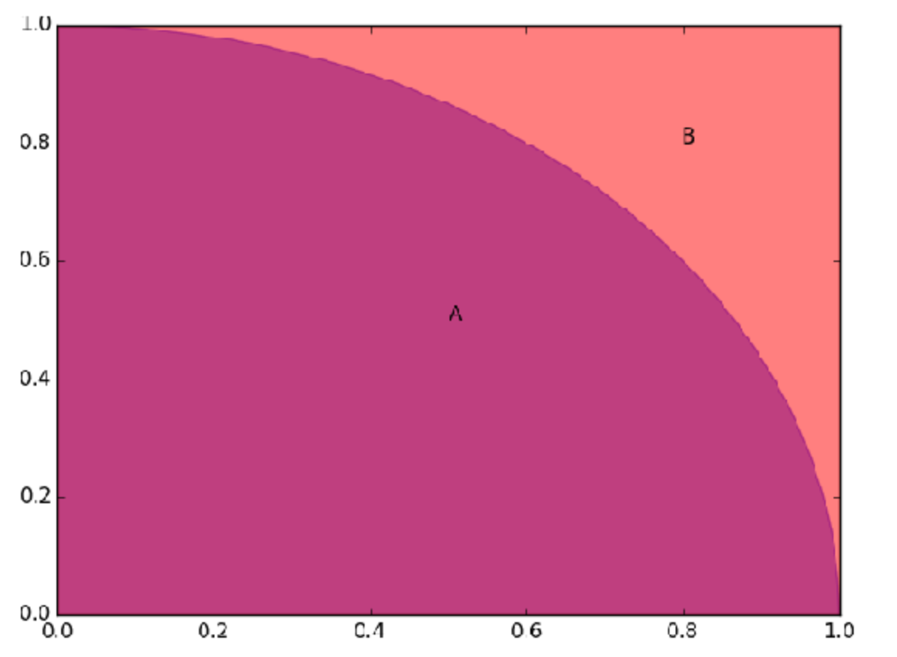
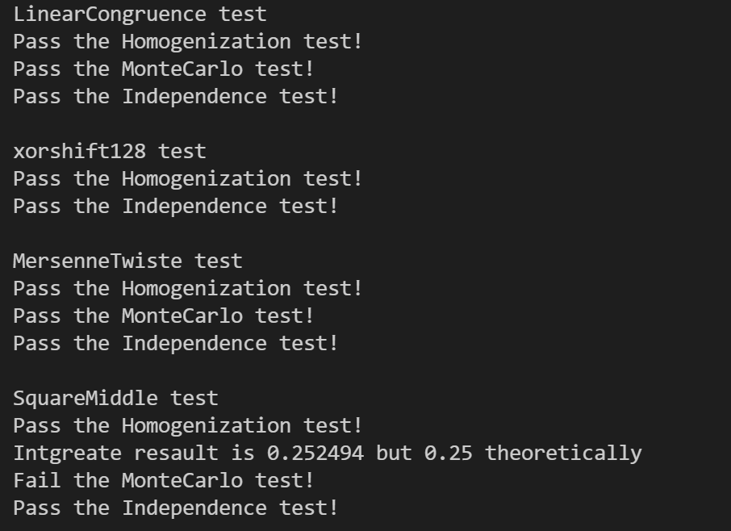

<center><b><font size = "7">《信息安全技术》Project


<center><b><font size = "5">题目：伪随机数生成


### 1 前言

​		什么是**随机数**？

​		 在一些问题中，比如枪击游戏里面子弹的命中扰动、密码学、仿真领域等等，需要产生一个随机数数列来解决问题。随机数数列又分为真随机数数列和伪随机数数列。真随机数数列是完全不可预测的，可以通过放射性衰变、电子设备的热噪音、宇宙射线的触发时间等物理过程得到，但无法通过单纯的软件方式获得；伪随机数数列是可预测的，严格意义上不具有随机性质，通常用数学公式的方法获得。

​		通过物理方法采集真随机数并不高效，而且获取速度缓慢、序列不可复现，如果将采集到随机数全保存下来则需要占用额外的存储空间，数量是有限。因此，在实际的科学工作中，往往采用**伪随机数**生成的数学方法。伪随机数，顾名思义，并不是真正意义上的随机数，只不过在不知其背后生成方式的情况下，生成的序列看上去毫无规律可言。


### 2 生成方法

#### 2.1 线性同余法

​		线性同余法是最早最知名的伪随机数生成算法之一，曾被广泛应用，后逐渐被更优秀的算法替代。其计算方法很简单，考虑如下递推式：
$$
X_{n+1}=(aX_n+c)\ mod\ m
$$
其中，$X$为伪随机数数列，有四个可以调整的参数：

- $m>0$为模数，也是生成序列的最大周期
- $0<a<m$，乘数
- $0\leq c<m$，增量
- $0\leq X_0 <m$，种子，也就是随机数数列的起点

​		这几个参数都需要谨慎选取，如果没有经过严谨的理论证明，很容易生成出一个非常有规律的数列。一些平台运行时采用的参数如下：


以下是我个人的实现：

```c++
class LinearCongruence{
private:
    LL a, c, m;
    LL x;
public:
    LinearCongruence() {
        a = 1554525; c = 1013904223;
        m = (1ull << 32);
        x = 0;
    }
    void setSeed(LL x0) {
        x = x0;
    }
    inline LL rand() {
        x = (1ll * a * x + c) % m;
        return x;
    }
    LL up_bound() {
        return (1ull << 32);
    }
};
```

#### 2.2 平方取中法

​		平方取中法是由冯·诺依曼在1946年提出的，其基本思想为：假设生成$m$位随机数，将数列中的第$i$项做平方运算，得到一个$2m$位的数字（若不足$2m$位，在最高位前补0），取其中间部分的$m$位数字，作为序列的下一项，由此产生一个伪随机数数列。公式如下：
$$
X_{n+1}=(10^{\lceil-\frac{m}{2}\rceil}\times X_n^2)\ mod\ 10^m
$$
其中，$X$为伪随机数数列，有两个可以调整的参数：

- $m>0$为生成的随机数的位数
- $0<X_0<10^{m}$为随机数数列的种子

以下为个人实现：

```c++
LL fpow(LL a, LL n) {
    LL ans = 1;
    while (n) {
        if (n & 1) ans *= a;
        a *= a; n >>= 1;
    }
    return ans;
}

class SquareMiddle{
private:
    LL m, x, mod;
public:
    SquareMiddle() {
        x = 0; m = 10;
        mod = fpow(10, m);
    }
    void setSeed(LL x0) {
        x = x0;
    }
    inline LL rand() {
        x = x * x;
        for (int i = 0; i < m / 2; i++) x /= 10;
        x %= mod;
        return x;
    }
    LL up_bound() {
        return mod;
    }
};
```

#### 2.3 xorshift128

​		xorshift128是一种优秀，短小并且简洁的随机数生成器，它通过了Diehard tests，Diehard tests是一连串的统计测试。其实现非常简单，但数学证明非常复杂，运用到大量的近世代数的知识。在此仅阐述方法和实现：

1. 给定$X_0,Y_0,Z_0$，其中$Z$为生成的随机数数列。
2. $X_{n+1}'=X_n\ xor\ (X_n<<16)$
3. $X_{n+1}''=X_{n+1}'\ xor\ (X_{n+1}'>>5)$
4. $X_{n+1}'''=X_{n+1}''\ xor\ (X_{n+1}'<<1)$
5. $X_{n+1}=Y_n,Y_{n+1}=Z_n,Z_{n+1}=X_{n+1}'''\ xor\ Y_n\ xor\ Z_n$

其实现如下：

```c++
class xorshift128{
private:
    unsigned long x, y, z;
public:
    xorshift128() {
        x = 123456789; y = 362436069; z = 521288629;
    }
    void setSeed() {
        x = 123456789; y = 362436069; z = 521288629;
    }
    inline unsigned long rand() {
        unsigned long t;
        x ^= x << 16; x ^= x >> 5; x ^= x << 1;
        t = x; x = y; y = z;
        z = t ^ x ^ y;
        return z;
    }
    unsigned long long up_bound() {
        return (1ull << 32);
    }
};
```

#### 2.4 马特赛特旋转演算法

​		马特赛特旋转演算法，是1997年提出的伪随机数生成算法，其修复了以往随机数生成算法的诸多缺陷，可快速生成高质量的伪随机数，且经过了广泛的统计学检验，目前在各种编程语言和库中已普遍存在或作为默认的伪随机数发生器，被认为是更可靠的伪随机数发生器。

​		其生成过程比较复杂，图示如下：


主要流程为：

1. 初始化$n$个状态：根据给定的种子点$x0$，通过移位、异或、乘法、加法等操作生成后续的$n−1$个状态$x_1$到$x_{n−1}$，bit位数为$w$；
2. 生成伪随机数：根据当前状态，通过移位、与、异或操作生成随机数；
3. 更新$n$个状态：每生成$n$个随机数后，在生成下一个随机数前，更新状态。

标准实现32bit版本称之为MT19937，参数设置如下：

- $(w,n,m,r)=(32,624,397,31)$
- $a=9908B0DF_{16}$
- $(u,d)=(11,FFFFFFFF_{16})$
- $(s,b)=(7,9D2C5680_{16})$
- $(t,c)=(15,EFC60000_{16})$
- $l=18$

个人实现代码如下：

```c++
class MersenneTwiste{
private:
    uint32_t w, n, m, r, a, f, u, d, s, b, t, c, l;
    uint32_t index;
    uint32_t* MT;
    uint32_t lower_mask, upper_mask;
public:
    MersenneTwiste() {
        w = 32; n = 624; m = 397; r = 31;
        a = 0x9908B0DF; f = 1812433253;
        u = 11; d = 0xFFFFFFFF;
        s = 7; b = 0x9D2C5680;
        t = 15; c = 0xEFC60000;
        l = 18;
        index = n + 1;
        MT = (uint32_t*)malloc(n * sizeof(uint32_t));
        lower_mask = (1ull << r) - 1;
        upper_mask = (1ull << r);
    }

    ~MersenneTwiste() {
        free(MT);
    }

    void setSeed(uint32_t x0) {
        uint32_t i;
        MT[0] = x0;
        for (i = 1; i < n; i++)
            MT[i] = (f * (MT[i - 1] ^ (MT[i - 1] >> 30)) + i);
        index = n;
    }

    inline void Twist() {
        uint32_t x, xA;
        for (uint32_t i = 0; i < n; i++) {
            x = (MT[i] & upper_mask) + (MT[(i + 1) % n] & lower_mask);
            xA = x >> 1;
            if (x & 0x1)
                xA ^= a;
            MT[i] = MT[(i + m) % n] ^ xA;
        }
        index = 0;
    }

    inline uint32_t rand() {
        uint32_t y;
        uint32_t i = index;
        if (index >= n) {
            Twist();
            i = index;
        }
        y = MT[i];
        index = i + 1;
        y ^= (y >> u); y ^= (y << s) & b; y ^= (y << t) & c; y ^= (y >> l);
        return y;
    }

    unsigned long long up_bound() {
        return (1ull << 32);
    }
};
```

#### 2.4 比较

| 算法                                                         | 优点                                                         | 缺点                                                         |
| ------------------------------------------------------------ | ------------------------------------------------------------ | ------------------------------------------------------------ |
| 线性同余法 | 只需要记住种子点即可复现整个序列，不需要储存；计算简便，复杂度低。 | 相邻点之间有相关性，随意设置参数会让序列落在几个稀疏平面上。 |
| 平方取中法 | 只需要记住种子点即可复现整个序列，不需要储存；计算简便，复杂度低。 | 容易产生周期性明显的数列，而且在某些情况下计算到一定步骤后始终产生相同的数甚至是零，或者产生的数字位数越来越小直至始终产生零。 |
| xorshift128                                                  | 短小，简便；通过了Diehard tests，Diehard tests一连串的统计测试。 | 无明显缺点。                                                 |
| 马特赛特旋转演算法                                           | 可快速生成高质量的伪随机数，且经过了广泛的统计学检验。       | 无明显缺点。                                                 |

### 3 测试指标

#### 3.1 指标

1. 均匀性：假设将所有随机数归一化到区间$[0,1]$中，以0.5为界，数字落在左右两边的数量应该相接近。
2. 覆盖性：对模拟需要的值，应几乎全部取到。
3. 循环性：不论序列有多长，应构成一个首尾相连的闭环序列。
4. 非循环性：一定是一个完整的循环，连接到种子。
5. 独立性：随机序列应只取决于随机生成算法。
6. 检验性：随机函数要能经得起各种统计检验。
7. 系统开销：时间复杂度和空间复杂度要尽量低。

#### 3.2 蒙特卡洛方法



​		如图所示，正方形的面积$A=1$，深红色部分为一个半径为$1$的圆的$\frac{1}{4}$，其面积为$B=\frac{\pi}{4}$。

​		利用几何图形的概率特性，来近似计算$\pi$的值。考虑在该图形上随机撒点，点落在$\frac{1}{4}$圆的个数为$C$，落在整幅图形上的个数为$D$。则有
$$
\frac{B}{A}=\frac{C}{D}=\frac{\pi}{4}
$$
​		对两个不同的种子生成两个随机序列，让随机数归一化到$[0,1]$中，分别记作$X$和$Y$。那么将$(x_i,y_i)$视为撒在平面上的随机点，计算$\pi$的值。

个人实现如下：

```c++
void testMonteCarlo(int n, LL x[], LL y[], LL upb) {
    long double s;
    int cnt = 0;
    for (int i = 0; i < n; i++) {
        long double yi = 1.0 * y[i] / upb, xi = 1.0 * x[i] / upb;
        if (yi <= fpower(xi, p))
            cnt++;
    }
    s = (long double) cnt / n;
    if (fabs(s - 1.0 / (p + 1)) < eps)
        cout << "Pass the MonteCarlo test!" << endl;
    else {
        cout << "Intgreate resault is " << s << " but "<< 1.0 / (p + 1) << " theoretically" <<endl;
        cout << "Fail the MonteCarlo test!" << endl;
    }
}
```


### 4 实验结果

对线性同余法、平法取中法、xorshift128以及马特赛特旋转演算法进行测试，结果如下：



可以看到除了平法取中法无法在误差范围内通过蒙特卡洛测试外，其余随机数生成算法均有良好的效果。


### 5 后记

​		伪随机数生成算法有很多，远不止报告中介绍的四种，还有WELL（2006，对Mersenne Twister的改进）等等。而随机数的测试方法也有很多，比如Diehard tests、Diehard tests等等。伪随机数生成是一个非常庞大且博大精深的分支学科，其对代数和离散数学的要求非常高，对密码学有着十分深远的影响。


### 6 附件

随机数生成算法头文件：`LinearCongruence.h`、`MersenneTwiste.h`、`SquareMiddle.h`\`xorshift128.h`

测试文件：`test.cpp`

使用命令：

```shell
g++ -g -o test test.cpp
./test
```


### 7 参考资料

- Pseudorandom number generator：https://wiki2.org/en/Pseudorandom_number_generator
- Linear congruential generator：https://wiki2.org/en/Linear_congruential_generator
- Randomness tests：https://wiki2.org/en/Tests_for_randomness#cite_note-Rit-7

- 平法取中法：http://johnhany.net/2013/11/random-algorithm-and-performance/

- Mersenne Twister：https://wiki2.org/en/Mersenne_Twister

